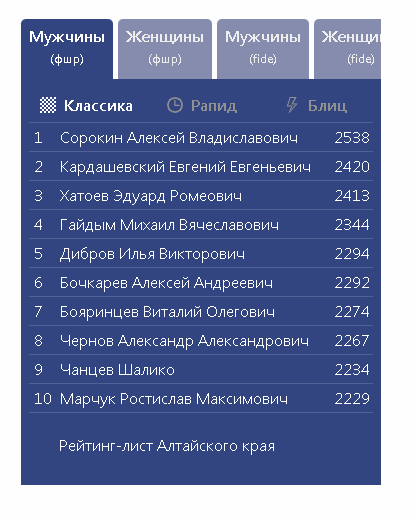
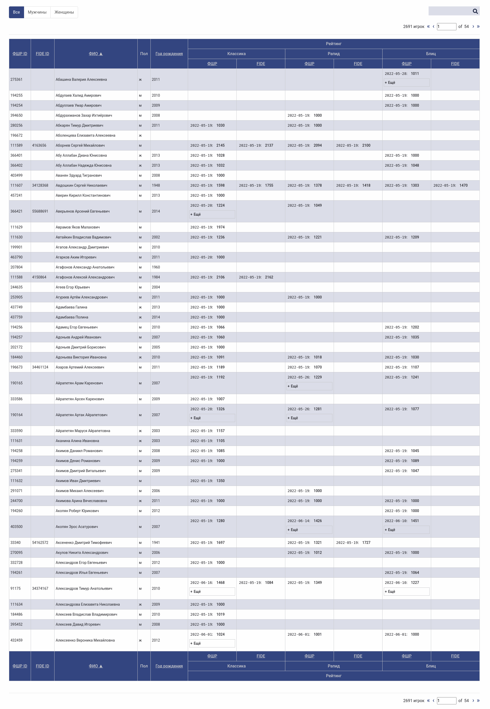
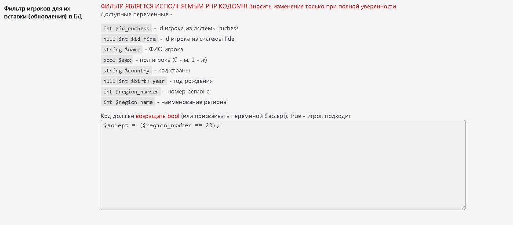

# RADIOFAN Chess Parser
Данный плагин позволяет парсить и данные игроков с сайта [ratings.ruchess.ru](https://ratings.ruchess.ru/api).  
С помощью шорткода `[chess_top_scoreboard list_url=""]` можно вывести актуальный блок топа игроков, атрибут list_url может содержать ссылку на список всех игроков.  
  
С помощью шорткода `[chess_players_page]` можно вывести таблицу с поиском, сортировкой и пагинацией всех игроков.
  
Также доступна настройка парсинга по фильтру.  
  
И просмотр логов.
