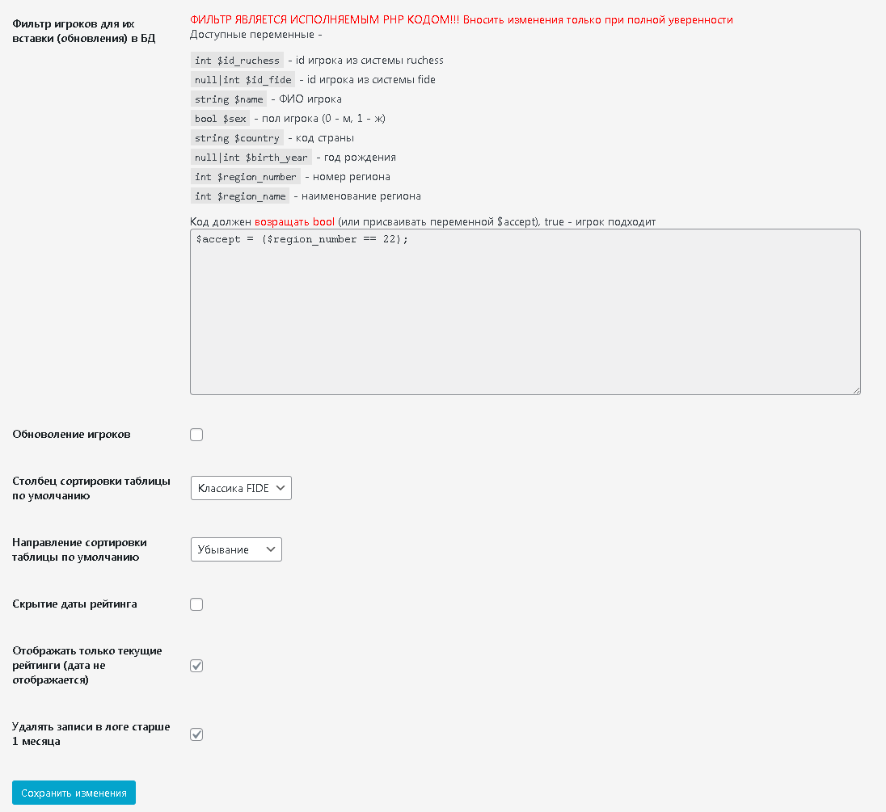
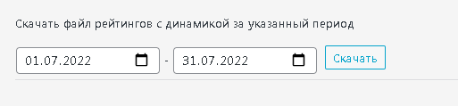
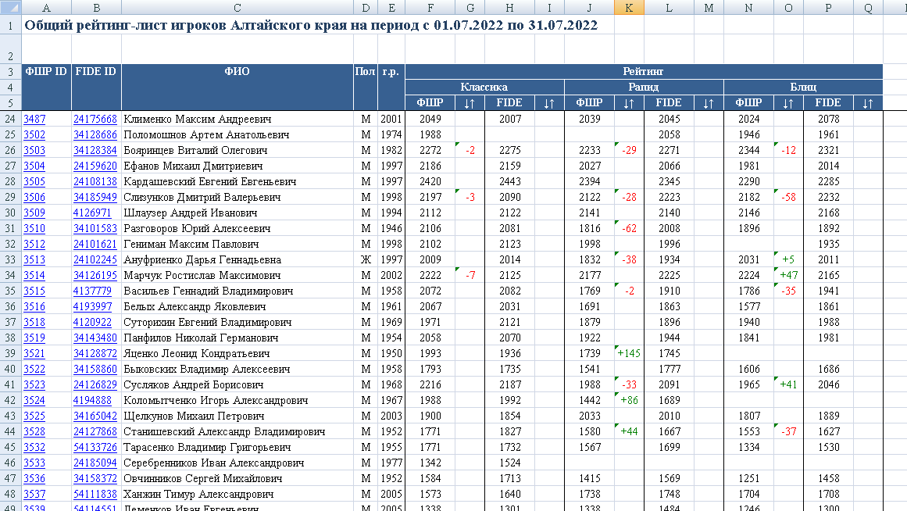

# RADIOFAN Chess Parser
Данный плагин позволяет парсить данные игроков с сайта [ratings.ruchess.ru](https://ratings.ruchess.ru/api), их рейтинги ruchess и [fide](https://ratings.fide.com/download_lists.phtml).  
Игроки добавляются и обновляются (доступна настройка в админ панели) из файла рейтингов ruchess, рейтинги fide обновляются только для добавленных игроков.  
С помощью шорткода `[chess_top_scoreboard list_url=""]` можно вывести актуальный блок топа игроков, атрибут list_url может содержать ссылку на список всех игроков.  
  
С помощью шорткода `[chess_players_page]` можно вывести таблицу с поиском, сортировкой и пагинацией всех игроков.
  
Также доступна настройка парсинга по фильтру, отображения таблицы,  
  
просмотр логов.  

Также имеется возможность выгружать excel таблицы с динамикой рейтингов за произвольный период (для админа), пользователям доступны файлы с динамикой за месяц (генерируются автоматически в последний день месяца). Для вывода списка файлов используется шорткод `[chess_month_ratings_files last="1|0"]`, атрибут last отвечает за вывод только последнего файла, или всего списка (по умолчанию).  
  
  

***

##История правок  

###V1.2  

- Добавлена возможность настройки в админ-панели столбца и направления сортировки по умолчанию
- Добавлен фильтр скрытия игроков, не имеющих рейтинг
- Добавлена возможность настройки в админ-панели отображения рейтингов в таблице, а именно скрытие даты рейтинга, и отображение только текущего рейтинга
- Возможность очистки поисковой строки в таблице игроков и рейтингов
- Добавлена возможность настройки в админ-панели автоочистки логов старше 1 месяца
- Добавлена возможность выгрузить **таблицу рейтингов с динамикой** с произвольным интервалом для админа в формате **Excel**
- Добавлена **автогенерация таблиц рейтингов** с динамикой за прошедший месяц в последний день месяца, доступных **для скачивания пользователям**
- Добавлен шорткод для вывода списка файлов таблиц рейтингов для скачивания
- **Теперь данные** пользователей заполняются из файла ruchess, с учетом фильтра в адимн-панели, **рейтинги ruchess берутся из этого же файла**; **Рейтинги fide** обновляются только для добавленных пользователей, **берутся из файлов [fide](https://ratings.fide.com/download_lists.phtml)**. 
